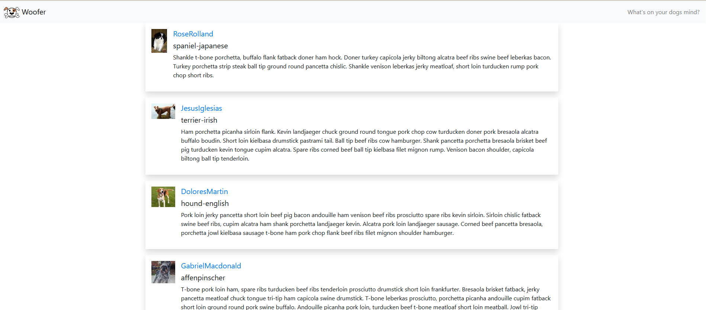
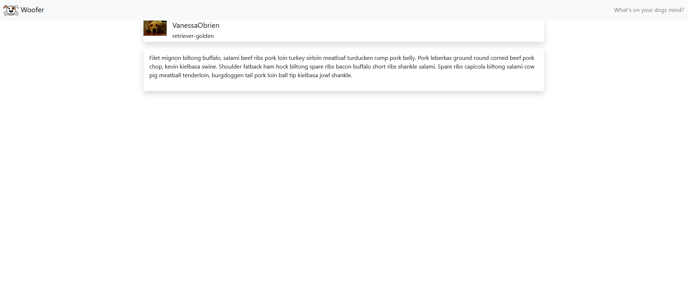

# Woofer - Whats on your dogs mind?

The goal of woofer is to create a proof of concept platform for dogs to Woof on.

The platform currently creates dogs using various APIs and generates their Woofs. Dogs really like to Woof about meat apparently!

The platform is really basic right now but I think it shows that we can create a platform where all Dogs can express themselves.

## Where you come in
I think this is production ready, but I need it reviewed! Help me find the bugs.

**hint** there are no compile errors, but there are a few runtime errors that occur

## Screenshots

 
